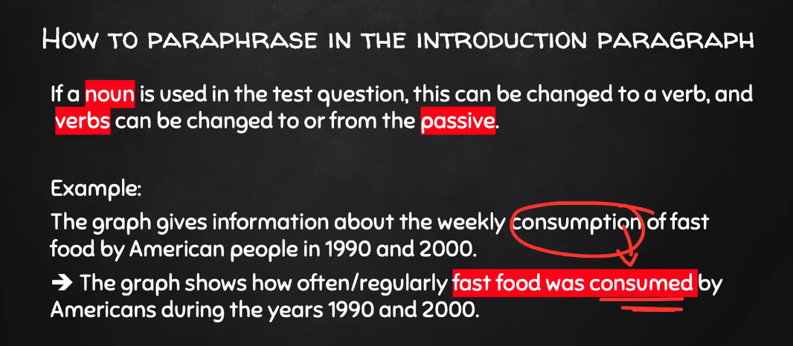
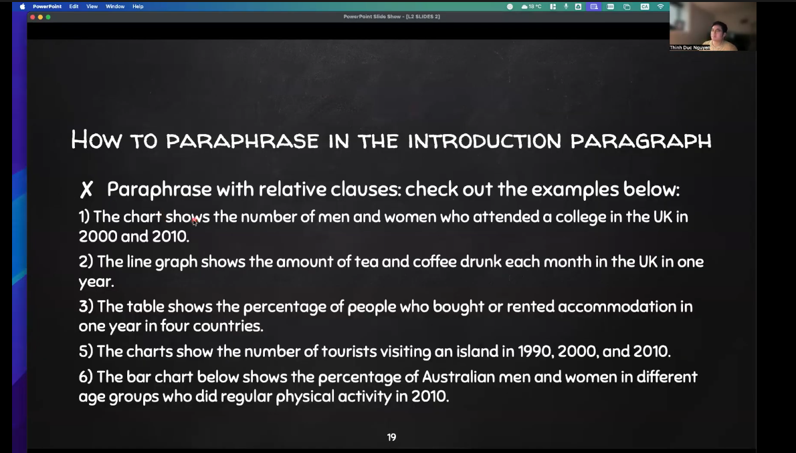
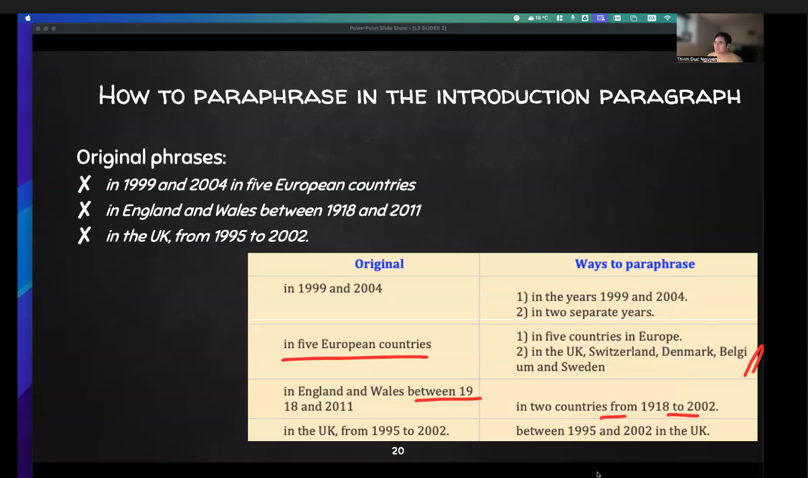
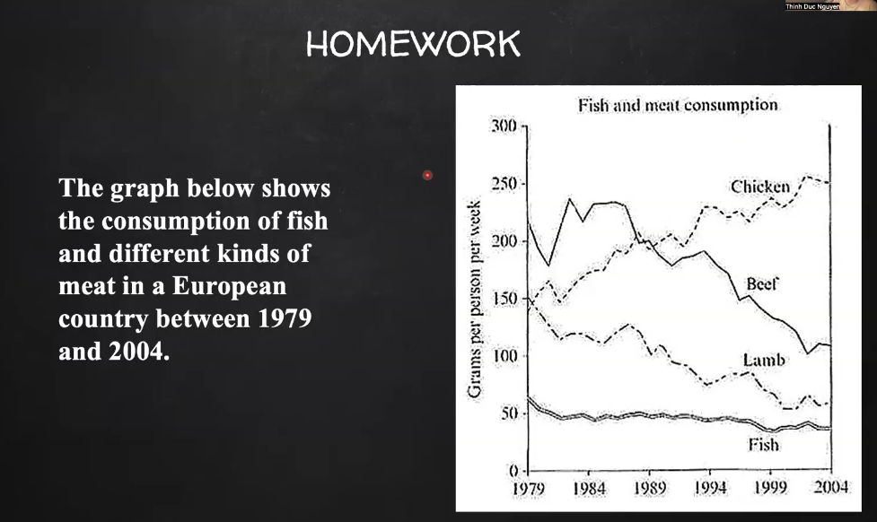
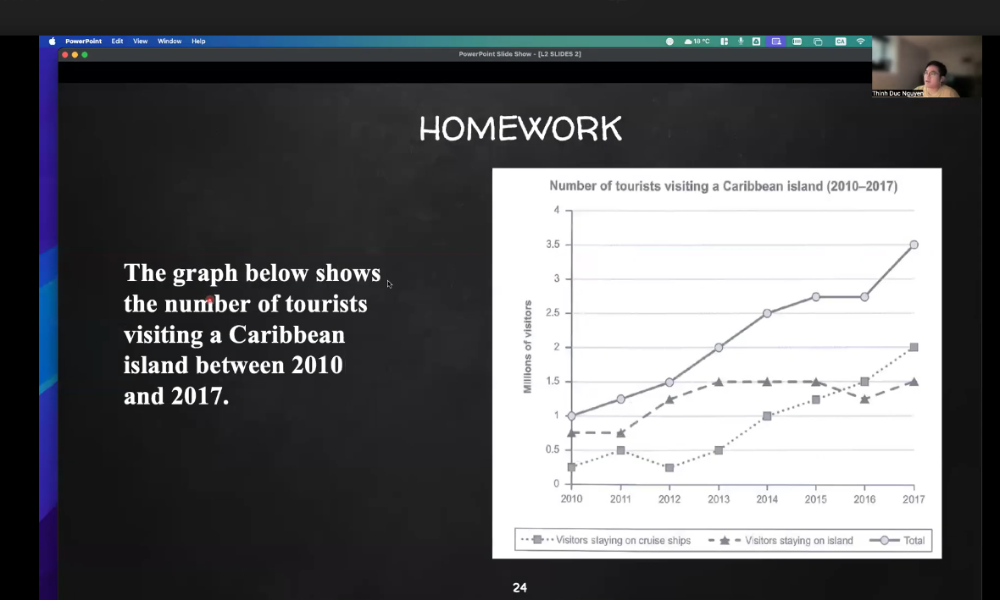

1. Đơn vị: "milion euros", not "milions of euros" (đề ghi cụm này nhma nó ko phải đơn vị) => milion Vietnam dons, milion dollas, ...
2. Ý nghĩa của Paraphrase là đa dạng ngôn ngữ
3. The charts give information about the cause of land degradation worldwide and in three regions of the world.
4. **How many (the number of) + "đếm được"/ How many (the amout of) + "ko đếm được"** trong introduction.
5. Dùng **"show" trong introduction là bình thường**.
6. about the weekly assumption of food => hot the fast food was cosumed  

7. **Dùng mệnh đề quan hệ**

8. **Paraphrase time**

9. Homework 1

10. Homework 2

