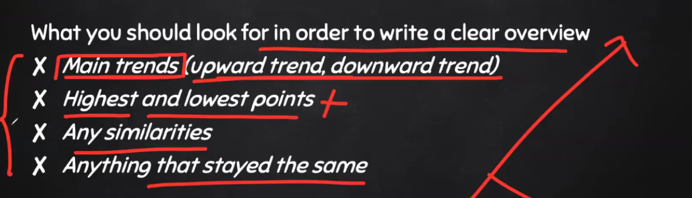
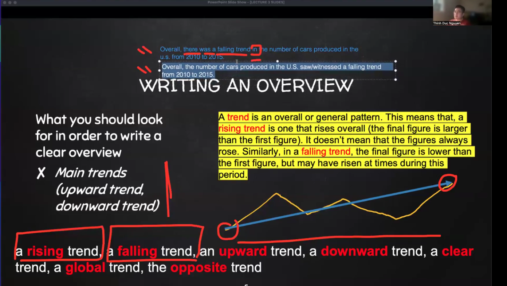
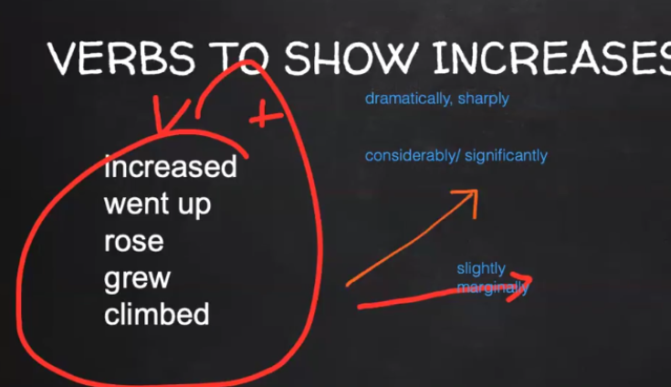
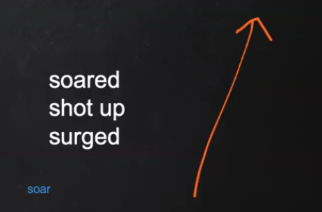
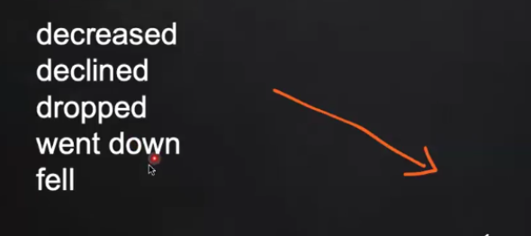
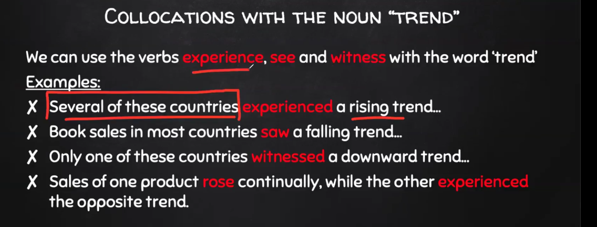
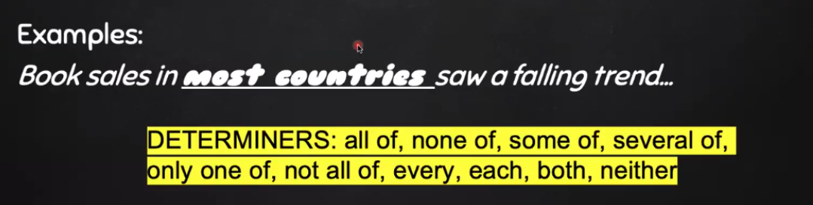
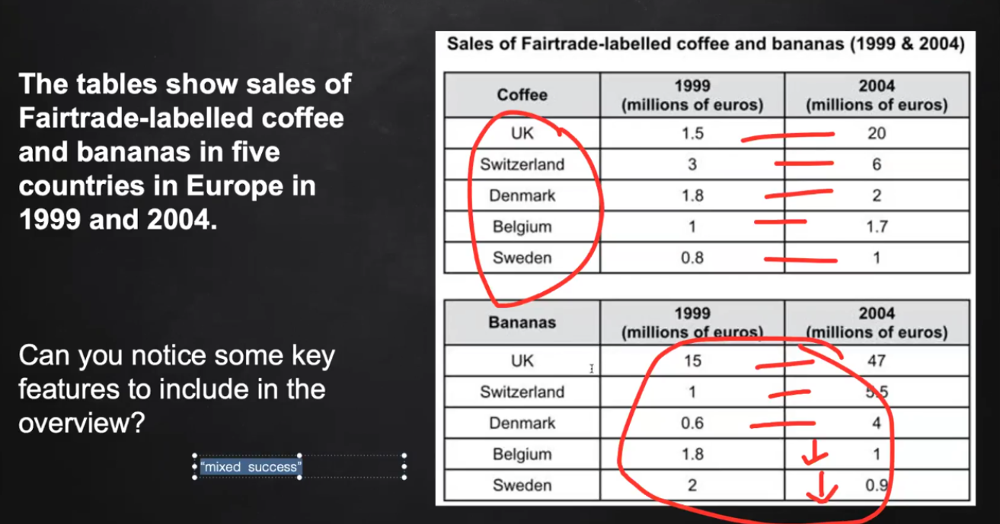

1. Overview chỉ mô tả chung, ko có chi tiết => Overal, In general, ...
2. 
3. Dài 1 2 câu
4. 

=> Các từ hay sài: **rising trend in**, **falling trend in** (phải có **in**)

5. 

6. 

7. 

=> Không xài adverb

8. 

=> Không xài adverb

9. 

10. 

11. 

=> mixed success => There was a mixed sucess in sales of Banana from 1999 to 2004.
=> UK is leader figure.

12. **Summarize: Nói ra trend + Leader figure**

13. 